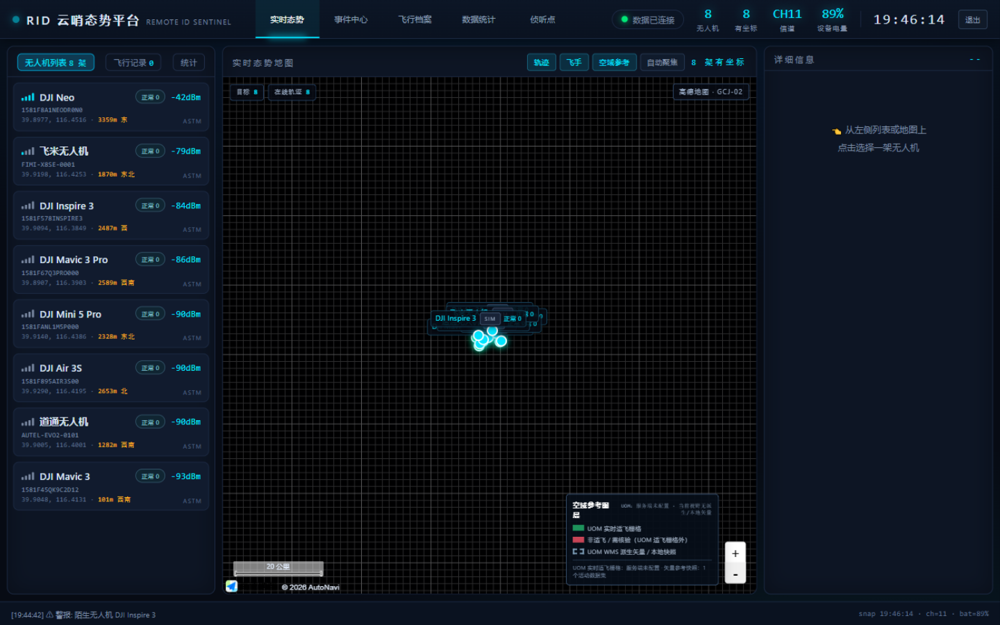
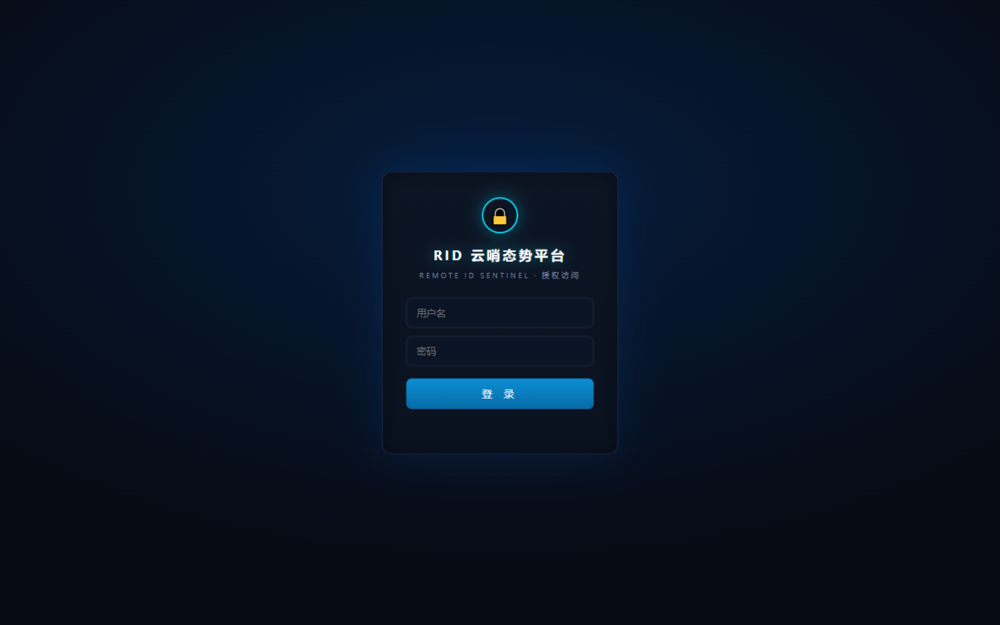
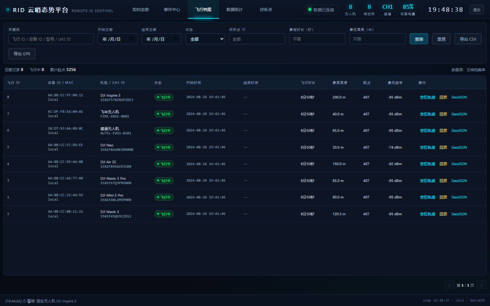
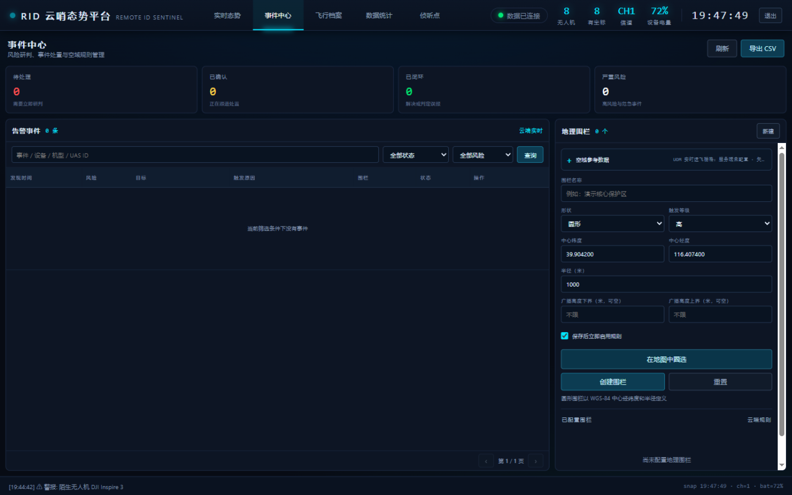

# RID 云哨态势平台

本仓库只开源 **网页 / 云端监测大屏**（原工程的 `display-server`），不包含 T-Display-S3 固件。
现场采集板通过 USB 串口把 RID 快照交给 `gateway.py`，再上报到本服务。



把 T-Display-S3 的 RID 串口快照变成可长期运行的监测系统：

- 实时地图、无人机/飞手位置、信号、距离和告警；
- 可解释风险分、圆形/多边形地理围栏、事件确认/结案/误报和证据留存；
- 可审计的空域参考快照、视野级地图图层，以及手机可用的圆形/多边形地图圈选；
- 服务端 SQLite 飞行历史、筛选、统计、轨迹回放及 CSV/GeoJSON 导出；
- 多哨站实时合并，同一 MAC 由信号更强的哨站代表，离线哨站自动剔除；
- 本地串口直连，或通过带持久化 spool 的 `gateway.py` 可靠上传云端；
- 服务端登录、HttpOnly session Cookie、受保护的读 API/WebSocket，以及独立的
  ingest Bearer token。

## 界面预览

登录页使用服务端校验，不是前端写死的假门禁。



实时态势把目标列表、高德地图、轨迹、飞手位置、空域参考和陌生机告警放在同一屏。演示数据使用公开示例坐标，不代表实际部署地点。


飞行档案保存每次飞行的时长、高度、航点和最低信号，支持定位、回放和 GeoJSON 导出。



事件中心负责风险研判、围栏规则和空域参考数据。



## 本地快速开始

安装依赖：

```powershell
python -m pip install -r requirements.txt
```

连接真机时先确认串口号，然后启动：

```powershell
	python server.py --port COMx
```

无硬件预览完整数据链路：

```powershell
python server.py --demo
```

浏览器打开 `http://127.0.0.1:8080/`。本地默认只监听回环地址，登录账号为
`admin / admin123`；校验发生在服务端，不是前端写死的假登录。若改为非回环监听，
必须显式配置强密码和 session secret。

默认历史库为 `data/rid_history.db`。实时航点在移动至少 2 米或距上次落点 5 秒时写入，
飞行信号中断 15 秒后结算，已结束历史默认保留 30 天。可通过命令行参数调整。

## 地图配置

不要修改 `dashboard.html` 写入 Key。服务端从环境变量生成只读的
`/runtime-config.js`：

```powershell
$env:AMAP_KEY = "你的 Web JS API Key"
$env:AMAP_SECURITY_CODE = "你的安全密钥"
python server.py --demo
```

未配置高德时仍可使用内置 Canvas 态势图、轨迹与回放。生产环境把这两个值写入服务器
的 `.env`，不要提交到 Git。

监测点使用 WGS-84 坐标配置；未设置时使用公开演示坐标：

```text
RID_MONITOR_LAT=39.9042
RID_MONITOR_LON=116.4074
```

## 空域参考数据与地图圈选

“侦听点 -> 空域与事件”中可导入 WGS-84 / EPSG:4326 GeoJSON，也可导入获授权取得的
UOM `flyableAirspace` 标准响应。每次导入保存来源、版本、有效期、抓取时间和 SHA-256；
新版本完整校验后才会原子替换活动版本，相同内容重复导入保持幂等。地图只按当前视野
查询 Polygon/MultiPolygon，适飞、警告、管制和明确禁飞使用不同样式。

本地警告区与监管空域是两层数据。创建或编辑围栏时点“在地图中圈选”，可直接拖动圆
或多边形顶点，完成后自动把高德 GCJ-02 坐标反算并回填为 WGS-84；取消不会修改表单。
未配置高德 Key 时仍可查看 Canvas 空域图层，但地图圈选会明确不可用并保留手工输入。

截至 2026-08-19，公开可查的 UOM/USS 接口要求仍是征求意见稿，生产 endpoint、单位
ID 和国密凭据不对公众开放。本项目没有凭据时明确显示“未配置”，即使仅填写了环境
变量也不会发送猜测的请求。取得正式授权和最终接口文档后还需实现并验收 SM3/SM4
适配器，才能把来源标记为 `authorized_sync`。适飞区以外应称“管制空域（需批准）”，
不能一概称为禁飞区。当前按运营方确认把 UOM 页面中的北京 `110000` 规则作为
`prohibited` 参考面展示，但它仍标记 `authoritative=false`，不等于正式授权同步。
全国覆盖台账和观察到的 UOM 图层代码见 `airspace_catalog.json`；依据和详细边界见
[PRODUCT_RESEARCH.md](PRODUCT_RESEARCH.md)。

## 云端与现场网关

生产模式下，云服务只接收带 Bearer token 的 `POST /api/ingest`，并将原始 WGS-84
数据写入 SQLite。现场 Windows 电脑运行 `gateway.py`，先把每条快照写入本地 SQLite
spool，再按顺序 HTTPS 上传；断网、DNS 或云服务中断后会自动续传，采集时间不会因
补传而改写。

```powershell
$env:RID_INGEST_TOKEN = "云端生成的 ingest token"
	python gateway.py --port COMx `
	  --url https://你的域名/api/ingest `
	  --station-id station-01 --station-name "示例哨站"
```

无硬件可用 `--stdin` 做端到端上报测试：

```powershell
'{"t":"snap","n":0,"ch":0,"bat":-1,"drones":[]}' |
  python gateway.py --stdin --url https://你的域名/api/ingest --station-id test-01
```

多哨站历史按 `stationId + MAC` 分开保存；实时 WebSocket 输出为所有在线哨站的合并
全量快照。超过实时窗口的断网补传只进入历史，不会让实时地图倒退。

## 模拟 RID 数据边界

公网服务不生成、也不接受独立 `simulator.py` 的模拟数据。实时目标只能由电脑上的
`gateway.py` 从 T-Display-S3 USB 串口采集后上传；网关心跳超时后实时地图自动归零。
板子在开机页选择“模拟 RID”时，固件生成的目标仍沿同一 USB 数据链路上传，并永久带
`simulated=true` 标记。选择“侦测 RID”时，只上传空口实际收到的目标。

`simulator.py` 仅保留给离线开发和单元测试，生产 `/api/ingest` 会拒绝其来源标记及
`RID-Demo-Simulator` User-Agent。

Docker、宝塔 Nginx、HTTPS、密钥生成、备份和验收命令见 [DEPLOY.md](DEPLOY.md)。
生产公网只有一个 HTTPS 入口；宿主机回环端口 `18081` 承载页面/API，`18082` 仅供
Nginx 的 `/ws` WebSocket 反代使用，二者都不应向公网放行。

## 登录与接口

本地默认凭据仅用于 `127.0.0.1`。云模式必须配置：

- `RID_ADMIN_USER`、`RID_ADMIN_PASSWORD`：大屏登录；
- `RID_SESSION_SECRET`：签名 HttpOnly session Cookie；
- `RID_COOKIE_SECURE=1`：HTTPS Cookie；
- `RID_INGEST_TOKEN`：现场网关上报专用，不能与登录密码复用。

公开端点只有页面、运行配置和 `/healthz`。登录后可使用：

| 接口 | 用途 |
|---|---|
| `POST /api/auth/login` | 创建服务端登录 session |
| `GET /api/auth/me` | 检查当前 session |
| `GET /api/status` | 数据库、哨站、航点和连接状态 |
| `GET /api/airspace/status` | 空域来源、活动版本、新鲜度和 UOM 连接器状态 |
| `GET /api/airspace/catalog` | 全国 31 个省级区划、UOM 观察图层和北京规则参考台账 |
| `GET /api/airspace/zones?bbox=...` | 按 WGS-84 视野、分类和时间查询活动空域 |
| `POST /api/airspace/import` | 管理员导入 GeoJSON 或 UOM 标准响应快照 |
| `POST /api/airspace/sync` | 请求正式连接器；未授权/未实现时明确返回 `503` |
| `GET/POST /api/geofences` | 查询或创建 WGS-84 圆形/多边形围栏 |
| `PUT/DELETE /api/geofences/{id}` | 修改、启停或删除围栏 |
| `GET /api/incidents` | 分页查询风险事件及不受分页影响的汇总 |
| `GET /api/incidents/{id}` | 查询事件、触发证据和处置时间线 |
| `POST /api/incidents/{id}/status` | 确认、解决、驳回或重开事件 |
| `GET /api/incidents/export.csv` | 按当前条件导出事件汇总 |
| `GET /api/incidents/{id}/evidence.json` | 下载可用 SHA-256 复核的原始证据 JSON |
| `GET /api/flights` | 分页查询飞行记录 |
| `GET /api/flights/{id}` | 查询记录及原始 WGS-84 航点 |
| `GET /api/flights/export.csv` | 按当前条件导出汇总 |
| `GET /api/flights/{id}/track.geojson` | 导出单次轨迹 |

`/api/flights` 支持 `q`、`from`、`to`、`status=all|active|completed`、
`station_id`、`min_duration`、`min_altitude`、`page` 和 `page_size`。

风险分只使用当前接收数据能够解释的规则：命中已启用围栏、缺失 UAS ID、缺失操作者
坐标和异常高速。`alt` 是发送端广播的几何高度，不等于距地高度 AGL，因此系统不会
把 `alt > 120m` 自动判成超高；围栏的最小/最大高度只表示用户显式配置的广播高度带。
事件证据保留触发时的围栏几何快照，围栏后来修改或删除也不会改写旧证据。

空域导入默认上限为 20 MiB、50000 个要素、单要素 20000 个顶点、总计 1000000 个顶点，
可分别通过 `RID_AIRSPACE_IMPORT_MAX_BYTES`、`RID_AIRSPACE_MAX_FEATURES`、
`RID_AIRSPACE_MAX_VERTICES_PER_FEATURE` 和 `RID_AIRSPACE_MAX_TOTAL_VERTICES` 调整。
`RID_UOM_AIRSPACE_ENDPOINT/CLIENT_ID/CREDENTIAL` 在取得正式授权前必须保持为空。

仓库内的 `airspace_catalog.json` 是全国覆盖台账：记录 31 个大陆省级区划，以及观察到的
6 组 UOM WMS 图层、覆盖的 30 个区划代码。北京 `110000` 另有一份离线禁飞规则参考面，
服务首次启动时仅在数据库没有该来源时自动种入；它明确标记为 `authoritative=false`，
边界只是行政区参考，不能替代 UOM 正式矢量快照或飞行审批结果。

## 主要参数

| 参数 | 默认值 | 说明 |
|---|---:|---|
| `--bind` | `127.0.0.1` | HTTP/WS 监听地址 |
| `--port` / `--baud` | `COMx` / `115200` | 真机串口配置 |
| `--http` / `--ws` | `8080` / `8765` | 本地 HTTP 与 WebSocket 端口 |
| `--demo` | 关闭 | 服务端模拟数据源 |
| `--cloud` | 关闭 | 云端 ingest 模式，不打开串口 |
| `--db` | `data/rid_history.db` | 历史 SQLite 路径 |
| `--flight-gap` | `15` | 飞行会话中断阈值（秒） |
| `--point-distance` | `2` | 航点最小位移（米） |
| `--point-interval` | `5` | 静止时最大采样间隔（秒） |
| `--retention-days` | `30` | 已结束历史保留天数，`0` 为不删除 |
| `--station-timeout` | `15` | 实时哨站离线阈值（秒） |
| `--live-max-age` | `30` | 补传进入实时层的最大年龄（秒） |

完整参数以 `python server.py --help`、`python gateway.py --help` 和
`python simulator.py --help` 为准。

## 串口协议

固件每秒输出一行 UTF-8 JSON 全量快照：

```json
{"t":"snap","n":1,"ch":6,"bat":78,"drones":[
  {"mac":"AA:BB:CC:00:11:22","model":"DJI Mavic 3","id":"1581F45QK9C2D12",
   "rssi":-55,"lat":39.9112,"lon":116.4210,"alt":120.5,"spd":8.2,
   "olat":39.9042,"olon":116.4074,"proto":0}
]}
```

`lat/lon` 与 `olat/olon` 分别为飞机和飞手坐标，`alt` 单位米，`spd` 单位 m/s，
`proto` 的 `0/1/2` 分别表示 ASTM F3411 / CN 46750 / OpenDroneID BLE。`gateway.py` 会在入队时增加
`capturedAt`、`stationId` 和可选 `stationName`。

## 文件

| 文件 | 作用 |
|---|---|
| `server.py` | 串口/演示/云 ingest、SQLite、API、鉴权、实时聚合与页面托管 |
| `gateway.py` | 现场串口采集、持久化 spool、HTTPS 重试 |
| `simulator.py` | 演示区域多机连续轨迹模拟与 HTTPS 上报 |
| `dashboard.html` | 正式监测大屏 |
| `demo.html` | 可独立打开的纯前端视觉演示，不代表云端持久化链路 |
| `verify.py` | Python/页面关键能力与 JavaScript 语法自检 |
| `test_cloud.py` / `test_simulator.py` | 云端、鉴权、历史、WS 与模拟器回归测试 |
| `DEPLOY.md` | Docker + 宝塔 Nginx 生产部署与运维 |
| `PRODUCT_RESEARCH.md` | 官方监管、行业产品矩阵、硬件能力边界和路线图 |

运行自检：

```powershell
python verify.py
```
